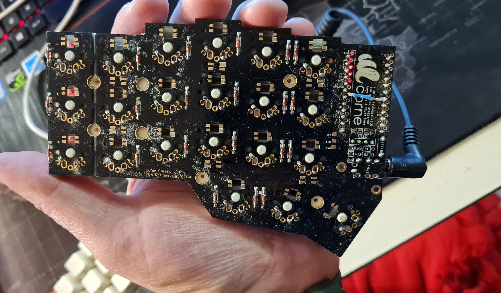

# My Corne Keyboard build

Pieces:
1. Otemu brown switches https://es.aliexpress.com/item/1005002378701948.html?spm=a2g0o.order_list.0.0.d42e194d7VWe7X&gatewayAdapt=glo2esp
1. Headphone Female Audio Connector Socket https://www.aliexpress.com/item/32869968774.html?spm=a2g0o.order_list.0.0.d42e194d7VWe7X&gatewayAdapt=glo2esp
1. Headphone Male Audio Aux TRRS https://www.aliexpress.com/item/1005001802977701.html?spm=a2g0o.order_list.0.0.d42e194d7VWe7X
1. Carbon PBT Keycaps https://www.aliexpress.com/item/1005001760558390.html?spm=a2g0o.order_list.0.0.d42e194d7VWe7X
1. 2 x 0.O1 Inches OLED Module Arduino https://www.aliexpress.com/item/32672229793.html?spm=a2g0o.order_list.0.0.d42e194d7VWe7X
1. 2 x Arduino Pro Micro
1. Kit PCB Corne Classic Negro

Instructions
1. 3d Print the case for the CRKBD. https://www.thingiverse.com/thing:4459741
1. Follow this solder guide, but I will give list here the most important steps. https://github.com/foostan/crkbd/blob/main/corne-classic/doc/buildguide_en.md
    1. Solder diodes as indicated in the picture (Make sure that they are placed in the right direction given their polarity)
   
    1. Flash ProMicros before soldering to make sure they are alright. Desoldering ProMicros is really hard and I say it by experience, so please check that they are ok before soldering and make sure that u are using the right soldering paste for electronics (Flux). 
    **I made the nooby mistake to use a solder paste not made for electronics. The paste produced bridges between different pins on the ProMicros resulting in malfunctioning and some little smoke. After going to the nearest electronic store and habing endured a couple of laughs they told me that the right paste to use was one in flux made specifically for electronics, and that I had to clean my hole build with Isopropilic Alcohol and after that let it dry exposed to the sun.

That mistake cost me two ProMicros because I first thought there was something going on with my soldering and given they are extreamly hard to remove I broke both of them on the removing process.

If you have to remove something please use Copper coils to forma a braid or use a good Desoldering Pumb or Bulb.**
    1. Solder the Pro Micros after checking their correct position
    1. Solder the Female audo connectors and the reset button.
    1. Put the switches on the 3d printed case. They should make a click when in the right position. 
    1. Place the case with the switches attached to it in the correct position over the PCB.
    1. Turn the PCB around and the case and switches with it to make the pins point upwards.
    1. Solder the pins of the switches to the PCB.

Tips:
* Please check that you are using the right soldering paste for electronics (Flux)
* Flash ProMicros before soldering to make sure they are alright.
* Use the right tools for the job. 
    * Desoldering Pump or Bulb
    * Copper coils
    * Tin welder with temperature control
    * Soldering paste for electronics with flux.
* At first I printed on paper the Distribution.docx and wrote over it all my keys.
 
Flashing the ProMicros
* Configuration page: https://config.qmk.fm/#/crkbd/rev1/LAYOUT_split_3x6_3
* Software to flash the ProMicros: https://github.com/qmk/qmk_toolbox/releases (Same one that is inside this repository)
1. First connect the ProMicro using a MicroUSB cable
1. Load the compiled configuration to the software
1. Select "Auto-Flash"
1. Hold the Reset button on the PCB for 5 seconds and then release it.
1. Wait for the flashing process to end.
